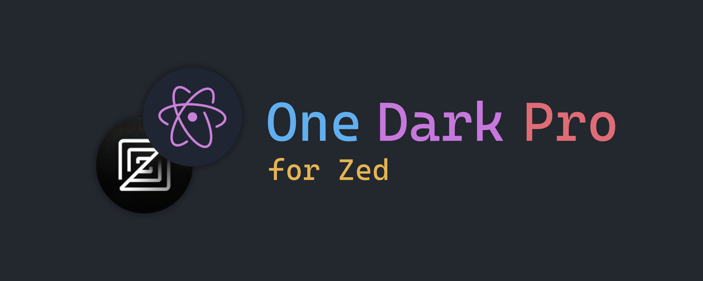
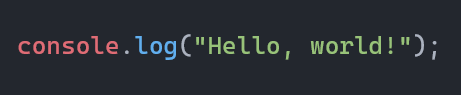
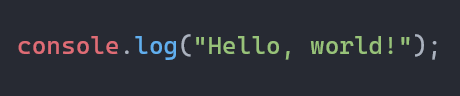
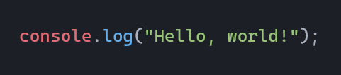
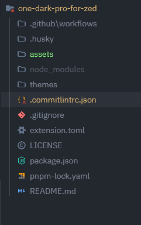
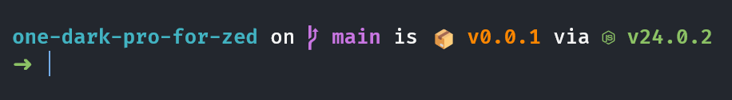

One Dark Pro for Zed brings the most popular Visual Studio Code theme to the Zed editor, offering a carefully crafted dark theme that enhances code readability and reduces eye strain during long coding sessions.

## Features

- 🎨 **Multiple Theme Variants**:
  - One Dark Pro (Classic)
  - One Dark Pro Darker
  - One Dark Pro Flat
  - One Dark Pro Mix
  - One Dark Pro Night Flat

 - ✨ **Optimized for Zed**:
   - Carefully adapted color schemes
   - Enhanced syntax highlighting
   - Consistent UI elements
   - Terminal colors optimization

## Screenshots

### One Dark Pro
This theme is the most basic, yet attractive. It features bold colors that make code easier to read. Ideal for programmers looking for a clean and attractive interface.

### One Dark Pro Darker
This theme, as its name suggests, is a bit darker than the default one (in case you're asking, it's my favorite ;D). It's perfect for resting your eyes and focusing more on your code.

### One Dark Pro Flat
This theme is lighter and has brighter colors, making it ideal if you struggle to find variables or functions in your code (like me).

### One Dark Pro Mix
This is a theme that combines all of the aforementioned themes, with dark colors and bold syntax, creating a visually appealing and functional atmosphere for development and programming.

### One Dark Pro Night Flat
One of the darkest mentioned on this list. It features a dark tone as the main color, and vibrant tones for the syntax, creating a contemporary and elegant theme.

## Other features

### Project Panel
The project panel maintains the signature dark aesthetic, with a balanced palette that highlights file and folder names without distracting from the code. Ideal for working during long sessions without eye strain.

### Terminal
The integrated terminal inherits the theme colors, ensuring a consistent experience between the editor and the command line. Text, warning, and error colors are carefully tuned for clear reading.

> [!NOTE]
> This preview uses the Starship theme for terminals, if you want to install it here you can ;): https://starship.rs/

## Installation

1. Open Zed
2. Go to Settings (⌘ + ,)
3. Navigate to Extensions
4. Search for "One Dark Pro for Zed"
5. Click Install

## Usage

1. Open Zed Settings (⌘ + ,)
2. Go to Themes
3. Select one of the One Dark Pro variants:
   - One Dark Pro
   - One Dark Pro Darker
   - One Dark Pro Flat
   - One Dark Pro Mix
   - One Dark Pro Night Flat

## Contributing

Contributions are welcome! If you'd like to contribute:

1. Fork the repository
2. Create your feature branch (`git checkout -b feature/amazing-feature`)
3. Commit your changes using conventional commits (`git commit -m 'feat: add some amazing feature'`)
4. Push to the branch (`git push origin feature/amazing-feature`)
5. Open a Pull Request

## License

This project is licensed under the MIT License - see the [LICENSE](LICENSE) file for details.

## Credits

- Original VS Code theme by [Binaryify](https://github.com/Binaryify/OneDark-Pro)
- Adapted for Zed by [@Hadez](https://github.com/hadez8877)

---

Made with ❤️ for the Zed community

