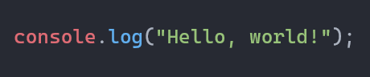
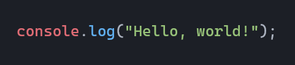

# Previews
Here you can find all the previews of the 4 themes included in this extension, so you can see at a glance what your favorite themes will look like before applying them.

### One Dark Pro
This theme is the most basic, yet attractive. It features bold colors that make code easier to read. Ideal for programmers looking for a clean and attractive interface.

### One Dark Pro Darker
This theme, as its name suggests, is a bit darker than the default one (in case you're asking, it's my favorite ;D). It's perfect for resting your eyes and focusing more on your code.

### One Dark Pro Flat
This theme is lighter and has brighter colors, making it ideal if you struggle to find variables or functions in your code (like me).

### One Dark Pro Mix
This is a theme that combines all of the aforementioned themes, with dark colors and bold syntax, creating a visually appealing and functional atmosphere for development and programming.

### One Dark Pro Night Flat
One of the darkest mentioned on this list. It features a dark tone as the main color, and vibrant tones for the syntax, creating a contemporary and elegant theme.

## Other features

### Project Panel
The project panel maintains the signature dark aesthetic, with a balanced palette that highlights file and folder names without distracting from the code. Ideal for working during long sessions without eye strain.

### Terminal
The integrated terminal inherits the theme colors, ensuring a consistent experience between the editor and the command line. Text, warning, and error colors are carefully tuned for clear reading.

> [!NOTE]
> This preview uses the Starship theme for terminals, if you want to install it here you can ;): https://starship.rs/

